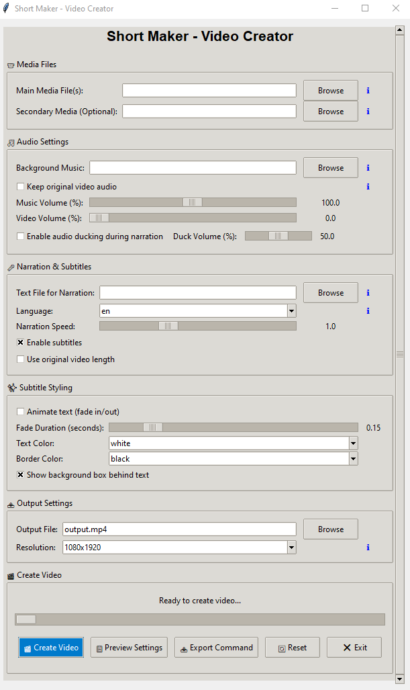

# Short Maker 🎬  

*"in the future entertainment will be randomly generated". Automate vertical video creation with zero AI*  



(GUI version shown - CLI version also available)

**Create professional short vertical videos** by combining videos, adding narration (TTS), dynamic subtitles, and audio mixing. Perfect for content creators who want to streamline their workflow. (Or if you want to make the [Dead Internet Theory](https://en.wikipedia.org/wiki/Dead_Internet_theory) real)

[](https://github.com/Hukasx0/short-maker/blob/main/LICENSE)

### Example Created Video:
Check out an example video created using Short Maker:  
[Watch the video on Twitter](https://x.com/hukasx0/status/1883965580702802214)

Created using two video files and a text file 
```
python short-maker.py video1.mp4 video2.mp4 -t script.txt -a --duck-volume 5 -vv 100
```

## Features ✨  
- 📼 Create vertical (9:16) video compositions  
- 🔊 Text-to-Speech narration with sync subtitles  
- 🎵 Background music mixing with volume control  
- 🦆 Audio ducking during narration  
- 🖼️ Smart video cropping/resizing  
- 🎞️ Full animated GIF support with auto-looping  
- 🐍 Pure Python, FFmpeg and ImageMagick - no AI/ML dependencies  

## Installation 📦  

### Quick Setup (Recommended) 🚀

We provide automated setup scripts that install everything for you:

#### **Windows:**
1. Download or clone this repository
2. Choose one of the setup options:
   - **Option A (Recommended):** Right-click on `setup_windows.ps1` and select **"Run with PowerShell as administrator"**
   - **Option B (Alternative):** Right-click on `setup_windows.bat` and select **"Run as administrator"**
3. Wait for the installation to complete (5-15 minutes)

**Note:** The PowerShell script (`setup_windows.ps1`) provides better error handling and ImageMagick configuration.

#### **Linux:**
```bash
git clone https://github.com/Hukasx0/short-maker.git
cd short-maker
chmod +x setup_linux.sh
./setup_linux.sh
```

**Virtual Environment (Linux):** The Linux setup creates a virtual environment for better Python package management. For manual usage:
```bash
# Activate virtual environment for manual command-line use
chmod +x activate_venv.sh
./activate_venv.sh

# Then use Short Maker
python short-maker.py --gui
```
*Note: GUI launchers (`run_gui_linux.sh`) automatically handle virtual environment activation.*

#### **macOS:**
```bash
git clone https://github.com/Hukasx0/short-maker.git
cd short-maker
chmod +x setup_macos.sh
./setup_macos.sh
```

**Virtual Environment (macOS):** The macOS setup creates a virtual environment for better Python package management. For manual usage:
```bash
# Activate virtual environment for manual command-line use
chmod +x activate_venv_macos.sh
./activate_venv_macos.sh

# Then use Short Maker
python short-maker.py --gui
```
*Note: GUI launchers (`run_gui_macos.sh`) automatically handle virtual environment activation.*

**macOS ARM64 (Apple Silicon) Notes:**
- The setup script automatically installs `python-tk` for better GUI support
- Tk deprecation warnings are automatically suppressed 
- If GUI is not visible, ensure you've run the setup script: `./setup_macos.sh`
- For best GUI experience, restart your terminal after setup

### Manual Installation (Alternative) 🔧

If you prefer to install manually or the automated scripts don't work:

#### Prerequisites  
- **Python 3.10.11** (Recommended & Tested)  
- **Git** (to clone the repository)  
- **FFmpeg**  
- **ImageMagick**  

#### How to Install Python  
1. **Download Python:**  
   - Go to the [official Python website](https://www.python.org/downloads/).
   - Download the latest version of Python 3 for your operating system.
2. **Install Python:**  
   - Run the installer and ensure that you **check the box "Add Python to PATH"** before proceeding with the installation.
   - Follow the on-screen instructions to complete the installation.

#### How to Install Git  
1. **Download Git:**  
   - Visit the [official Git website](https://git-scm.com/downloads) and download the appropriate version for your operating system.
2. **Install Git:**  
   - Run the installer and follow the default instructions.

#### Cloning the Repository  
You have two options to obtain the source code:
1. **Clone using Git:**  
   Open your terminal or command prompt and run:
```sh
git clone https://github.com/Hukasx0/short-maker.git
```
2. **Download as ZIP:**  
   - Click the **"Code"** button on the repository page.
   - Select **"Download ZIP"** and then extract the contents to your desired location.

#### Installing Other Dependencies  

1. **Windows:**  
```sh
# 0. Install Chocolatey (Windows Package Manager)
#    Open Windows PowerShell as Administrator and run:
Set-ExecutionPolicy Bypass -Scope Process -Force; [System.Net.ServicePointManager]::SecurityProtocol = [System.Net.ServicePointManager]::SecurityProtocol -bor 3072; iex ((New-Object System.Net.WebClient).DownloadString('https://community.chocolatey.org/install.ps1'))

# 1. Install dependencies  
choco install ffmpeg imagemagick  

# 2. Add to PATH (search for Environment Variables)  
#    Add paths to ffmpeg.exe and magick.exe  

# 3. Configure ImageMagick for MoviePy
#    Short Maker automatically detects and configures ImageMagick on Windows
#    Ensure 'magick.exe' (not 'convert') is accessible from command line
```

2. **Linux:**  
```sh
sudo apt-get install ffmpeg imagemagick
```

3. **macOS:**  
```sh
brew install ffmpeg imagemagick
```

4. **All Systems:**  
(Before installing Python packages, make sure you change to the project directory where `requirements.txt` is located.)
```sh
cd short-maker
pip install -r requirements.txt
```


## Preparation 🛠️  
1. Install required tools from above  
2. Prepare your video file/files (supports videos, images, and animated GIFs)
3. (Optional) For narration: create text file with script  
4. (Optional) Find background music  

## Usage 🚀  

### GUI Mode (Recommended for Beginners) 🖥️

#### Quick Launch (One-Click) 🚀
Use these launcher scripts that automatically handle setup if needed:

**Windows:**
```cmd
# Double-click or run in Command Prompt
run_gui_windows.bat
```

**Linux:**
```bash
chmod +x run_gui_linux.sh
./run_gui_linux.sh
```

**macOS:**
```bash
chmod +x run_gui_macos.sh
./run_gui_macos.sh
```

#### Manual Launch 💻
```bash
# Launch the graphical interface directly
python short-maker.py --gui
```

The GUI provides an intuitive interface with:
- 📁 File browsers for easy selection
- 🎛️ Visual controls for all settings
- ℹ️ Helpful tooltips explaining each feature
- 📊 Real-time progress tracking
- 📤 Export settings as CLI command
- 🔄 Settings preview and reset options

#### ⚠️ GUI Display Issues (Tkinter Compatibility)
**Known Issue:** On some screens/systems, the GUI window may appear truncated or show only partial controls.

**Solution:** If you experience this issue:
1. **Resize the window** by dragging the window borders
2. **Maximize the window** using your system's maximize button
3. **Manually adjust** window width and height by dragging corners
4. **Scroll** within the GUI if scrollbars appear

This is a Tkinter display limitation that can occur on certain screen configurations or display settings. The GUI can be made fully functional with manual window adjustment.

### Command Line Mode (Advanced Users) 💻
```bash
# Two videos with background music  
python short-maker.py top.mp4 bottom.mp4 -m music.mp3 -o output.mp4  

# Single video with narration  
python short-maker.py input.mp4 -t script.txt -o narrated.mp4
```

### Advanced Command Line Example  
```bash
python short-maker.py top.mp4 bottom.mp4 \  
  -m music.mp3 -t script.txt \  
  -o final.mp4 -r 1080x1920 \  
  -mv 20 -vv 100 --duck-volume 40 \  
  -a \
  --animate-text \
  --fade-duration 0.15 \
  --text-color "#00FF00" \
  --text-border-color black \
  --no-bg-box \
  --use-video-length
```

### All Flags Explained 🏁  
| Flag | Description | Default |  
|------|-------------|---------|  
| **Interface** | |
| `--gui` | Launch graphical user interface | False |
| **Video Composition** | |  
| `top_video` | Path to main video file | **Required** |  
| `bottom_video` | Secondary video (optional) | None |  
| `-m`, `--music` | Background music file | None |  
| `-o`, `--output` | Output filename | output.mp4 |  
| `-r`, `--resolution` | Target resolution | 1080x1920 |  
| `-mv`, `--music-volume` | Music volume (0-100) | 100 |  
| `-a`, `--audio` | Keep original video audio | False |
| `-vv`, `--video-volume` | Original video volume (requires `-a` to work) | 0 |  
| **Narration** | |  
| `-t`, `--text` | Narration script file | None |  
| `-l`, `--lang` | TTS language code | en |  
| `-ns`, `--no-subtitles` | Disable subtitles | Enabled |  
| `--duck-volume` | Lower background audio during TTS speech | Off |  
| `--use-video-length` | Match video duration | False |  
| `-s`, `--speed` | Narration speed multiplier | 1.0 |
| `--animate-text` |	Enable subtitle fade-in animation |	False
| `--fade-duration` |	Text fade-in, and fade-out animation duration (seconds) |	0.15
| `--text-color` |	Subtitle text color (name/hex) |	white
| `--no-bg-box` |	Disable semi-transparent background box |	Enabled
| `--text-border-color` |	Text border/shadow color |	black
| `--image-duration` |	Duration per image file in seconds |	5.0
| `--transition-type` |	Transition effect between multiple files |	none
| `--transition-duration` |	Duration of transition effects in seconds |	0.5
| `--start-transition` |	Transition effect at start of entire video (fade recommended) |	none
| `--end-transition` |	Transition effect at end of entire video (fade recommended) |	none

## Multiple Images Support 🖼️

Short Maker supports creating videos from multiple images in three ways:

### 1. Multiple Files (Semicolon Separated)
```bash
# 3 images, each 5 seconds = 15 second video
python short-maker.py "image1.jpg;image2.jpg;image3.jpg" --image-duration 5 -m music.mp3 -o slideshow.mp4
```

### 2. Directory Path
```bash
# All images in directory, automatically sorted
python short-maker.py /path/to/images/ --image-duration 3 -t script.txt -o gallery.mp4
```

### 3. GUI Multiple Selection
In GUI mode, when browsing for media files, you'll be asked if you want to select multiple files for image sequences.

**With Narration:** When using text-to-speech, the narration duration is distributed evenly across all images.

**Without Narration:** Each image displays for the specified `--image-duration`.

## Animated GIF Support 🎞️

Short Maker has full support for animated GIFs, which play as animations and loop automatically:

### Features:
- **Automatic Animation Detection**: Animated GIFs are detected and loaded as video clips
- **Smart Looping**: GIFs automatically loop to fill the specified duration
- **Seamless Integration**: Works with all existing features (narration, transitions, split-screen)
- **Fallback Support**: If GIF loading fails, automatically falls back to static image handling

### Examples:
```bash
# Single animated GIF (loops automatically to match duration)
python short-maker.py animation.gif --image-duration 10 -m music.mp3 -o gif_video.mp4

# Animated GIF with narration (GIF loops during narration)
python short-maker.py funny.gif -t script.txt -o narrated_gif.mp4

# Split-screen with animated GIF and static image
python short-maker.py animation.gif photo.jpg --image-duration 8 -m background.mp3 -o mixed_gif.mp4

# Multiple animated GIFs with transitions
python short-maker.py "gif1.gif;gif2.gif;gif3.gif" --transition-type fade --transition-duration 0.5 --image-duration 6 -o gif_slideshow.mp4

# Mix of animated GIFs and static images
python short-maker.py "intro.gif;photo1.jpg;animation.gif;photo2.jpg" --image-duration 4 -m music.mp3 -o mixed_sequence.mp4
```

### Technical Notes:
- Requires **Pillow (PIL)** library (included in requirements.txt)
- GIFs shorter than `--image-duration` automatically loop to fill the time
- GIFs longer than `--image-duration` are trimmed to the specified duration
- Works with all transition effects and start/end transitions

## Transition Effects 🎬

Short Maker supports smooth transitions between multiple media files with customizable effects:

### Available Transition Types:
- **none**: No transition (default)
- **fade**: Fade in/out effect
- **slide_left**: Slide in from right
- **slide_right**: Slide in from left  
- **slide_up**: Slide in from bottom
- **slide_down**: Slide in from top
- **zoom_in**: Zoom in effect (starts small)
- **zoom_out**: Zoom out effect (starts large)

### Examples:
```bash
# Fade transitions between images
python short-maker.py "img1.jpg;img2.jpg;img3.jpg" --transition-type fade --transition-duration 1.0 -o slideshow.mp4

# Slide transitions with custom duration
python short-maker.py "photo1.jpg;photo2.jpg" --transition-type slide_left --transition-duration 0.8 -m music.mp3

# Zoom effects between videos
python short-maker.py "video1.mp4;video2.mp4" --transition-type zoom_in --transition-duration 0.5
```

### Start/End Transitions (Entire Video):
```bash
# Fade in at start, zoom out at end of the entire short
python short-maker.py video.mp4 --start-transition fade --end-transition zoom_out --transition-duration 1.0

# Slide in from left at start of any video/image
python short-maker.py image.jpg --start-transition slide_left -m music.mp3 --image-duration 10

# Zoom in at start and slide out at end, works with any content
python short-maker.py video.mp4 --start-transition zoom_in --end-transition slide_right -t script.txt

# Works with multiple files too - transitions apply to the entire final video
python short-maker.py "img1.jpg;img2.jpg" --start-transition fade --end-transition zoom_out --transition-type slide_left
```

**Note:** 
- **Multi-file transitions**: Work between clips in sequences (`--transition-type`)
- **Start/End transitions**: Apply to the beginning and end of the entire final video (`--start-transition`, `--end-transition`)
- **Universal compatibility**: Start/End transitions work with any content (single files, multiple files, videos, images)
- **Improved stability**: Automatic fallback to fade transitions if complex effects fail
- **Best practices**: Use 'fade' transitions for most reliable results
- Transition duration is automatically limited to prevent exceeding clip durations
- Zoom transitions now properly handle different image resolutions

## Why No AI? 🤖  
This script intentionally uses simple TTS (gTTS) instead of AI voice generation:  
1. No API keys required  
2. Faster processing  
3. Smaller footprint  

## License & Author 📜  
**Author:** [Hubert Kasperek](https://github.com/Hukasx0)

**License:** [GNU Affero General Public License v3.0](https://github.com/Hukasx0/short-maker/blob/main/LICENSE)

